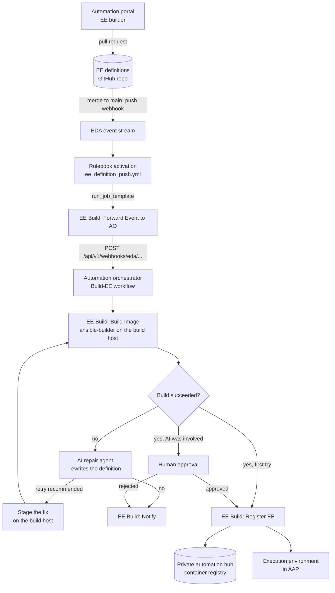

# EE build automation: automation portal → EDA → automation orchestrator

Build an execution environment automatically when someone saves a definition in
the Ansible automation portal's execution environment builder. If the build
fails, an AI agent reads the build log, rewrites the definition and the build
runs again. When it works, the image is pushed to private automation hub and
registered in Ansible Automation Platform.



The corrected definition never reaches Git. It is passed from the AI step to a
staging step, which writes it to a scratch file on the build host that the next
attempt picks up. What you merged stays what is in `main` until you choose to
put the fix there.

**Why a staging step rather than a workflow variable:** the orchestrator refuses
any reference to a step that has not run yet, and it has no default-value
syntax, so the build step cannot reference the AI step on the first attempt. It
also exposes no execution ID to a step and, on this deployment, script steps are
disabled. Staging the file is what is left, and it keeps the loop free of
cross-step references.

## What is in here

| Path | What it is |
|---|---|
| `playbooks/ee_build.yml` | Builds the image with `ansible-builder`. Reports the outcome through `set_stats` instead of failing, so the orchestrator can read the log and retry. |
| `playbooks/ee_register.yml` | Pushes the image to private automation hub and creates or updates the execution environment in AAP. |
| `playbooks/ee_apply_fix.yml` | Reads the agent's answer, decides whether a retry is warranted, and stages the corrected definition on the build host for the next attempt. |
| `playbooks/ee_notify.yml` | Reports a build that failed, was rejected, or that the agent would not retry. |
| `playbooks/ao_forward_event.yml` | Turns a GitHub push into one orchestrator trigger call per changed definition. |
| `playbooks/ee_cleanup.yml` | Removes an execution environment from controller, hub and the build host. Job template **EE Build \| Remove EE**, with a survey. |
| `playbooks/ee_builder_prep.yml` | Installs podman and `ansible-builder` on the build host. Run once. |
| `rulebooks/ee_definition_push.yml` | The rulebook behind the activation. |
| `rulebooks/ee_definition_push_direct.yml` | An experiment: calling the orchestrator from the rulebook with no job template in between. See [below](#can-eda-call-the-orchestrator-directly). |
| `workflows/build-ee.json` | The Build-EE workflow, with the loop, the AI repair step and the approval gate. |
| `setup/configure_aap.yml` | Creates the credentials, project, job templates and EDA wiring in AAP. |
| `setup/sync_hub_collections.yml` | Syncs a pinned set of collections into the hub's community repository, so hub-only builds have content to pull. |
| `setup/configure_ao.yml` | Creates the orchestrator service account and imports and publishes the workflow. |
| `portal/README.md` | Configuring the portal to publish definitions to GitHub. |
| `examples/` | One definition that builds and one that fails on purpose. |

Nothing here holds a secret or a hostname. Every environment-specific value is a
variable; the values live in `secrets.yml`, which is git-ignored. Start from
[`setup/secrets.example.yml`](setup/secrets.example.yml).

## Setup

You need: AAP 2.5+ with Event-Driven Ansible and a private automation hub,
automation orchestrator with an AAP integration already configured, a build host
in an inventory, and an automation portal.

```bash
git clone https://github.com/<you>/ee-build-automation-portal-ao.git
cd ee-build-automation-portal-ao
cp setup/secrets.example.yml secrets.yml    # then fill it in

# 1. Orchestrator: service account, workflow, EDA trigger.
#    Prints a client ID and a client secret. Put them in secrets.yml.
ansible-playbook setup/configure_ao.yml -e @secrets.yml

# 2. AAP: credentials, project, job templates, event stream, activation.
#    Prints the event stream URL for the GitHub webhook.
ansible-playbook setup/configure_aap.yml -e @secrets.yml
```

Then:

3. Run the **EE Build | Prep Builder Host** job template once.
4. Add a webhook to the EE definitions repository: the event stream URL as the
   payload URL, content type `application/json`, the `github_hmac_secret` value
   as the secret, and the `push` event only.
5. Send a test push and confirm the event arrives, then take the event stream
   out of test mode so events reach the activation.
6. Configure the portal, as described in [portal/README.md](portal/README.md).
   That covers both the GitHub publishing side and pointing the portal's
   collection catalog at private automation hub.
7. Stock the hub if it is thin: `ansible-playbook setup/sync_hub_collections.yml
   -e @secrets.yml`. Builds only see what the hub holds.
8. Give the workflow's AI step an LLM provider in the orchestrator:
   **Configuration > Integrations > Add**, type *LLM provider* (Red Hat AI,
   OpenAI, Anthropic, Gemini or custom), then enable a model and mark it
   default. Without one, a failed build stops at the repair step.

## Things that bite

- **The event stream starts in test mode.** Events are recorded but never reach
  the activation until you turn it off. Watch for this after a rerun of
  `configure_aap.yml`: it now leaves the current setting alone, but an earlier
  version turned test mode back on, and a chain that stops this way looks
  healthy from every angle — GitHub reports a 200, the stream counts the event,
  and the activation simply never sees it.
- **A running activation cannot be patched.** Rerunning `configure_aap.yml`
  leaves it alone; delete it (or pass `eda_replace_activation=true`) to pick up
  a changed rulebook.
- **Orchestrator conditions have no boolean literals.** A bare `true` or `false`
  is read as a step name, which is why the agent answers `yes` and `no`.
- **A do_while condition runs after the body**, so it can reference the build
  step, and the loop's `complete` port fires on success as well as on giving up.
- **Everything after the loop hangs off its exit**, not off the condition inside
  it. Nodes outside the loop body run once, so a build that only succeeded on a
  retry never reached them.
- **Taking one branch of a condition marks the other as skipped, permanently.**
  A node that two branches both point at gets skipped by the first one and stays
  skipped, so each branch here ends at its own node: two register steps and
  three notify steps rather than one of each.
- **Collections come from private automation hub only.** `ee_galaxy_url` puts
  the hub's `rh-certified`, `validated`, `published` and `community`
  repositories in the build's galaxy configuration. Setting
  `ee_galaxy_public_fallback: true` adds galaxy.ansible.com, but then the
  newest version anywhere wins: ansible-galaxy resolves across every configured
  server rather than in list order, so an unapproved public release can beat
  the one in your hub. A collection missing from the hub fails the build, and
  the agent's diagnosis says so.
- **`validate_certs` per galaxy server is not enough.** It covers API calls;
  collection *downloads* honour `[galaxy] ignore_certs`. A hub whose
  certificate a base image cannot chain fails at download time with
  "unable to get local issuer certificate" even though discovery worked.
- **Definitions from the portal set `source:` to a server alias**, which
  `ansible-galaxy` rejects: it wants an HTTP Galaxy URL there. The agent strips
  those and lets the configured server list resolve the collections, so the
  chain self-corrects, but it costs a build attempt.
- **Base images need an explicit tag.** `registry.redhat.io` rejects `latest`
  for the ee-minimal repositories.

## Removing one again

Demos leave execution environments behind in three places. Run the **EE Build |
Remove EE** job template and answer its survey:

| Question | Default |
|---|---|
| Execution environment name | — |
| Check first, remove nothing | `false` |
| Remove from automation controller | `true` |
| Remove from private automation hub | `true` |
| Remove images and build files from the build host | `true` |

Answering `true` to *check first* lists what would go without touching
anything. A target that is already gone reports "not found" rather than
failing, so reruns are quiet and a half-finished cleanup can be completed by
running it again.

## How the loop decides what to do

| Situation | What happens |
|---|---|
| The build succeeds on the first attempt | The image is registered. No approval needed. |
| The build fails | The agent gets the definition that was built and the tail of the build log, and returns a corrected definition plus a structured diagnosis. |
| The agent recommends a retry | The staging step writes the corrected definition to the build host, and the loop builds again from it. |
| The agent will not retry, or the fix touches credentials, a registry or the base image | The workflow stops and notifies instead of burning attempts. |
| A build succeeds after the agent changed something | A human approves before the image is published. |
| Four attempts pass with no working build | The workflow notifies. |

## The AI never writes to Git

The corrected definition only exists in the workflow run and in the build host's
working directory. If you want to keep a fix, take the definition from the
approval prompt or the build job's artifacts and open a pull request yourself.
That keeps `main` reviewed and stops a repaired build from triggering itself
again through the webhook.

## Can EDA call the orchestrator directly?

Partly. The orchestrator has a native Event-Driven Ansible trigger, and the
workflow here uses it. What EDA cannot do on its own is make the HTTP call:
rulebook actions launch job templates and workflow templates, and that is all.
So a small job template makes the call, which is also what Red Hat's own
documentation for the trigger does.

`rulebooks/ee_definition_push_direct.yml` tries the shortcut with a `run_module`
action. Red Hat documents `run_module` as unsupported in the Event-Driven
Ansible controller, and the trigger endpoint wants a service account bearer
token that a single module call cannot fetch first. Try it if you like; the
job template route is the supported one.
